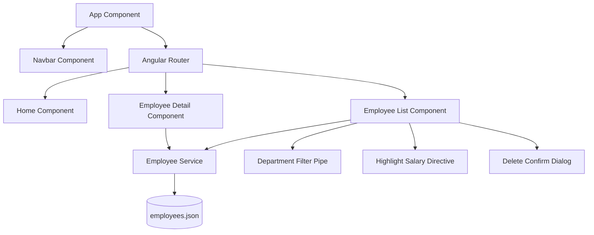

# Employee Management App

A modern Angular application for managing employee data with a premium UI using Angular Material.

## Features

- **Services & Routing**: centralized `EmployeeService` with `HttpClient` and `BehaviorSubject`. Dynamic routing with `AuthGuard`.
- **Pipes & Directives**:
  - `DepartmentFilterPipe`: Filter employees by department.
  - `HighlightSalaryDirective`: Automatically highlight high-earners (> 80,000 INR).
  - Built-in Currency and Date pipes.
- **Reactive Forms**: Robust validation for employee creation/editing, including email regex and range checks.
- **Material UI**: Implementation of `MatTable`, `MatDialog`, `MatCard`, `MatToolbar`, and more.
- **HTTP Interceptor**: Logging for all API requests.

## Architecture



## Setup Instructions

1. **Install Dependencies**:
   ```bash
   npm install
   ```

2. **Run Locally**:
   ```bash
   npm run start
   ```
   The app will be available at `http://localhost:4200`.

3. **Build**:
   ```bash
   npm run build
   ```
